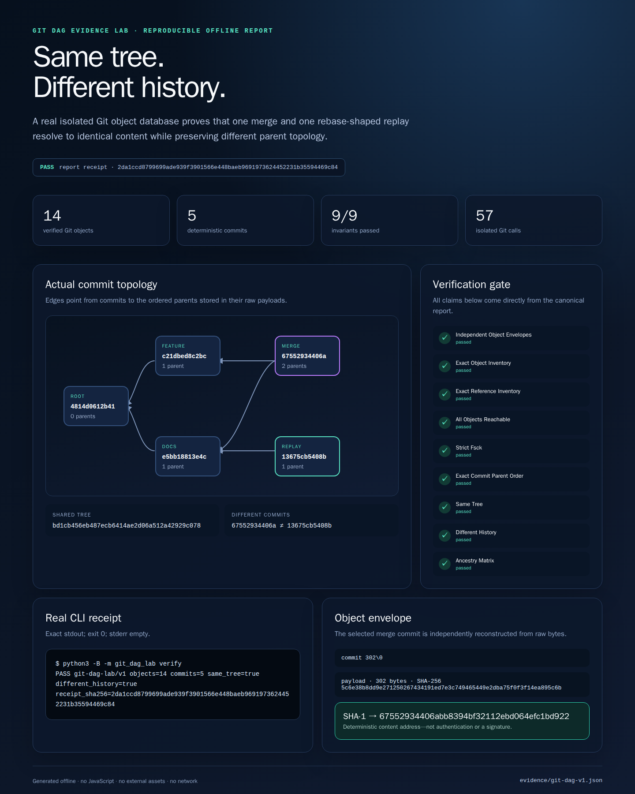
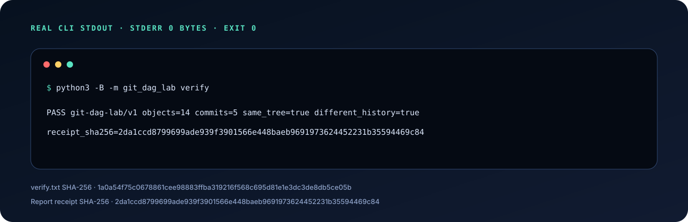
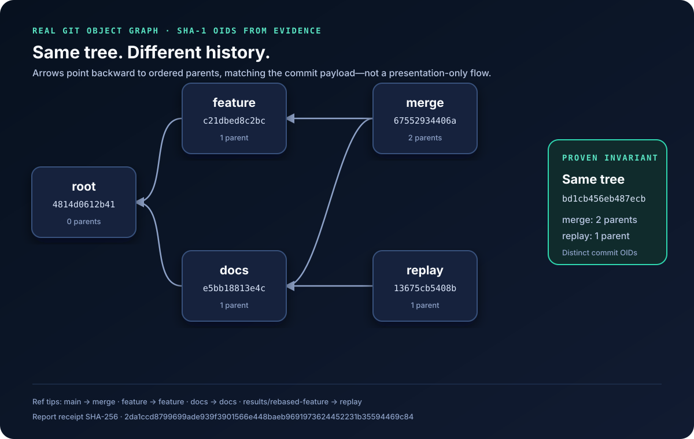
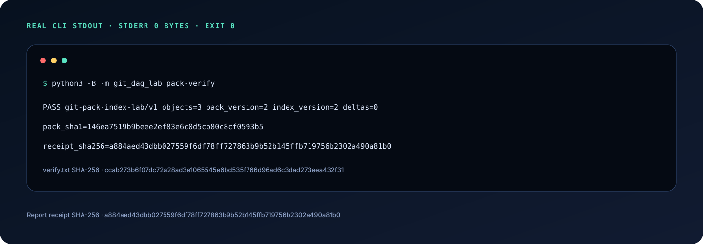
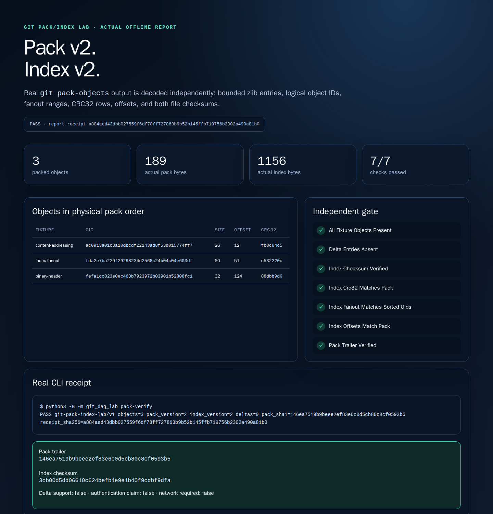
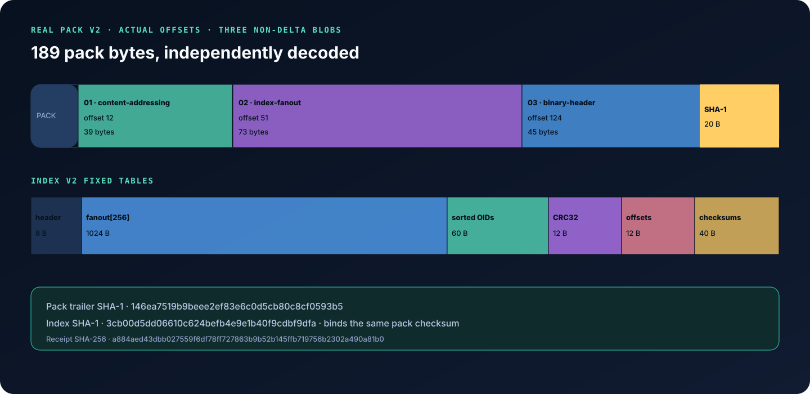
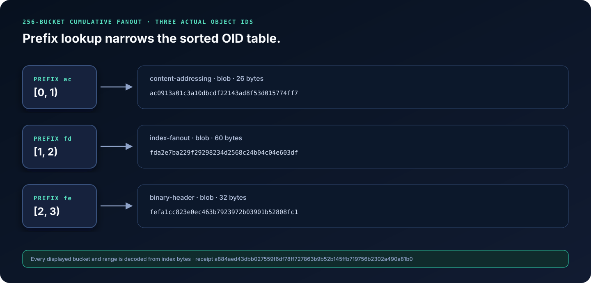
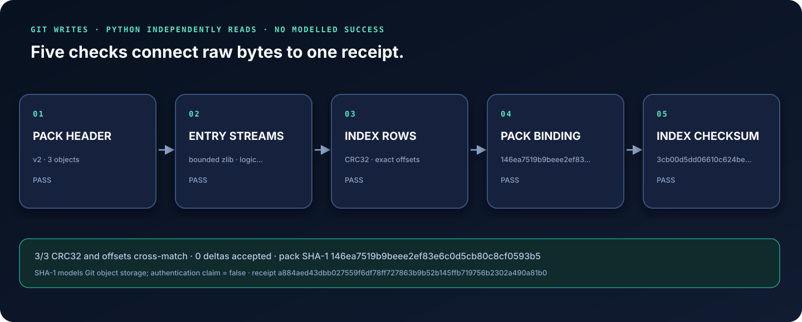
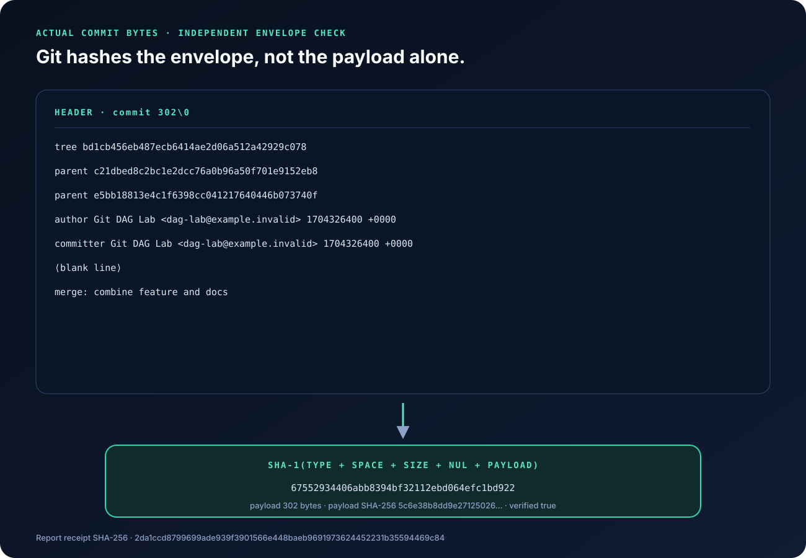
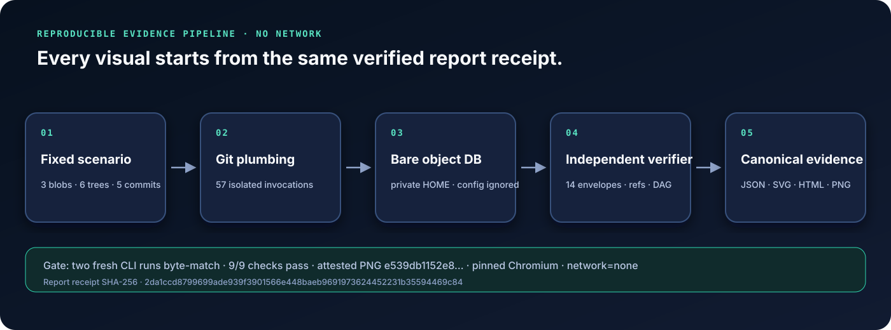

# Git DAG Evidence Lab

> A dependency-free Python systems lab that constructs real Git object storage, then independently verifies loose-object DAGs plus closed-subset pack v2/index v2 bytes.

The experiment demonstrates a subtle but important property: a merge commit and a rebase-shaped replay can resolve to **exactly the same tree** while preserving **different histories**.



<p align="center"><sub>Attested 1440×1800 Chromium capture of the checked-in offline report. Report receipt `2da1ccd8…69c84`; screenshot SHA-256 `e539db11…e17e`. No external assets, JavaScript, network, secrets, or host-repository data.</sub></p>

## Quick start

Requirements: Python 3.10+ and Git 2.29+. There are no runtime Python dependencies.

```bash
python3 -m git_dag_lab verify
python3 -m git_dag_lab inspect
python3 -m git_dag_lab pack-verify
python3 -m git_dag_lab pack-inspect
python3 -m unittest discover -s tests -v
```

The first command creates a private temporary bare repository, builds 14 objects, verifies the graph, prints one receipt, and removes the repository:



```text
PASS git-dag-lab/v1 objects=14 commits=5 same_tree=true different_history=true receipt_sha256=2da1ccd8799699ade939f3901566e448baeb9691973624452231b35594469c84
```

## What the lab actually builds

The fixture contains three blobs, six trees, and five commits. `merge` stores the ordered parents `[feature, docs]`; `replay` stores only `[docs]`. Their tree IDs match, their commit IDs differ, and neither result commit is an ancestor of the other.



The replay is called **rebase-shaped** because it is constructed directly with `git commit-tree`. The lab does not claim to execute porcelain `git rebase`.


## A second systems slice: verify pack and index bytes

The pack path stores three fixed synthetic blobs in a fresh private SHA-1 repository, invokes real `git pack-objects`, then removes the repository after independently decoding both generated files. The CLI receipt below is actual stdout from that production path:



The offline report is rendered from the same canonical receipt and captured by digest-pinned Chromium in a read-only, network-disabled container:



The verifier does not trust the pack filename or Git's index. It parses the variable-length pack entry headers, bounds each zlib stream, reconstructs logical blob IDs, verifies the pack trailer, then parses the 256-entry cumulative fanout table, sorted OIDs, CRC32 rows, 32/64-bit offsets, pack binding, and index checksum.







This is deliberately a closed subset: pack v2 and index v2, at most 64 objects, 1 MiB files, 256 KiB expanded objects, and non-delta entries only. Delta entries (OFS/REF), other object formats, arbitrary repositories, reachability, and pack optimization are not claimed. SHA-1 and CRC32 model Git storage integrity here; neither is presented as authentication, a signature, or collision-resistant security.

## The hard part: verify Git without trusting Git

Writing an object with Git and asking Git to identify it would only prove that Git agrees with itself. This lab reads the raw stored bytes and independently computes:

```text
SHA-1("type" + SPACE + decimal_size + NUL + payload)
```

It repeats that calculation for all 14 objects, parses binary tree records, checks Git's directory-aware ordering, parses ordered commit parents, verifies exact refs and reachability, runs strict `git fsck`, and tests the complete ancestry matrix.



SHA-1 is used because this scenario models a SHA-1 Git object database. Here it demonstrates deterministic content addressing and fixture integrity; it is **not** presented as collision-resistant authentication, a signature, or a security token.

## Isolation and execution boundaries

- Git is resolved once to an absolute executable and invoked with argument arrays, never a shell.
- 11 local subcommands are allow-listed, including the bounded `pack-objects` path, while one fixed isolated `git init` creates each bare database; transport commands and remote-looking arguments are rejected.
- `HOME`, `XDG_CONFIG_HOME`, and `TMPDIR` are private; inherited Git config, hooks, replacement objects, identity, and object-directory redirects are ignored.
- fixed synthetic identity `dag-lab@example.invalid`, fixed UTC timestamps, and fixed LF payloads make object IDs reproducible.
- symlinked workspace components are rejected; stdout/stderr are spooled privately and checked before bounded reads.
- the host repository is never inspected by the experiment.

See [SECURITY.md](SECURITY.md) for the threat model and trusted-input boundary.

## Evidence pipeline

Every README visual begins with a canonical production CLI document. The DAG and pack generators each run fresh experiments twice, require byte-identical outputs, derive their SVGs and offline HTML, and bind every artifact into a hash manifest. Digest-pinned Chromium captures both reports in read-only containers with `--network none`. Separate attestations bind each exact report, rendered DOM, PNG, browser binary/version, container digest, isolation policy, viewport, and capture-script hash; without the matching attestation, a generator refuses to call its screenshot verified.



### Reproduce the checked-in evidence

```bash
# Verify both JSON/transcript/visual/report/manifest packages and PNG attestations.
python3 -B tools/generate_evidence.py --check
python3 -B tools/generate_pack_evidence.py --check

# Rebuild and recapture either offline report with pinned Chromium.
tools/capture_report.sh
tools/capture_pack_report.sh

# Run all parser, boundary, CLI, evidence, and provenance tests.
python3 -W error -m unittest discover -s tests -v
```

Current verified baseline: **89 tests**, **9/9 graph invariants**, **7/7 pack/index checks**, **57 isolated Git invocations** in the DAG evidence run, two independently replayed evidence packages, and two attested offline browser captures.

| Artifact | What it proves |
|---|---|
| [`evidence/git-dag-v1.json`](evidence/git-dag-v1.json) | Canonical compact report, all objects, refs, checks, raw envelope proof, and receipt |
| [`verify.txt`](docs/demo/git-dag-v1/verify.txt) | Exact stdout from the real `verify` command; exit `0`, empty stderr |
| [`inspect.json`](docs/demo/git-dag-v1/inspect.json) | Human-readable output from the real `inspect` command |
| [`report.html`](docs/demo/git-dag-v1/report.html) | Dependency-free offline report used for the browser capture |
| [`rendered-dom.html`](docs/demo/git-dag-v1/rendered-dom.html) | Actual DOM emitted by Chromium during the attested capture |
| [`capture-attestation.json`](docs/demo/git-dag-v1/capture-attestation.json) | Report/DOM/PNG hashes plus verified browser, container, isolation, viewport, and script provenance |
| [`manifest.json`](docs/demo/git-dag-v1/manifest.json) | SHA-256, byte size, role, source hashes, normalized argv, and attestation receipt |
| [`git-dag-report.png`](docs/assets/git-dag-report.png) | Actual Chromium rendering of the DAG report at 1440×1800 |
| [`evidence/git-pack-index-v1.json`](evidence/git-pack-index-v1.json) | Canonical real pack/index receipt, physical entry order, cross-bound rows, and non-claims |
| [`git-pack-cli.svg`](docs/assets/git-pack-cli.svg) | Exact production `pack-verify` stdout rendered as an accessible terminal panel |
| [`git-pack-layout.svg`](docs/assets/git-pack-layout.svg) | Actual pack offsets/sizes and index-table byte counts |
| [`git-pack-fanout.svg`](docs/assets/git-pack-fanout.svg) | Actual non-empty fanout buckets and sorted OID ranges |
| [`git-pack-integrity.svg`](docs/assets/git-pack-integrity.svg) | Receipt-derived pack/index checksum and row-binding workflow |
| [`git-pack-report.png`](docs/assets/git-pack-report.png) | Actual Chromium rendering of the pack/index report at 1440×1500 |
| [`git-pack-index-v1/manifest.json`](docs/demo/git-pack-index-v1/manifest.json) | Hash/size/source/command/capture inventory for every pack visual and output |

## Test coverage by risk

The standard-library suite exercises more than happy-path graph construction:

- independent blob, tree, and commit envelope hashes;
- pack v2 headers, bounded zlib streams, logical OIDs, trailer checksum, and explicit delta rejection;
- index v2 fanout, sorted OIDs, CRC32 rows, small/large offsets, pack binding, and checksum mutations;
- exact object/ref inventories, parent ordering, reachability, and ancestry;
- Git's special `directory/` tree ordering, truncated binary objects, and malformed headers;
- hostile inherited Git environment and fake global identity/config;
- symlinked and NUL-containing roots, subprocess timeouts, output limits, and sanitized failures;
- concurrent deterministic runs, temporary cleanup, and immutable report/receipt binding;
- byte-identical evidence regeneration, visual receipt binding, PNG dimensions, source hashes, CSP, and secret/host marker rejection.

## Project history

This repository began as Omar Ibrahim's AI1030 Git exercise. The three original files are preserved byte-for-byte in [`docs/history`](docs/history/) while the repository evolves through reviewable portfolio-grade commits.

## License

No license has been granted for this repository.
